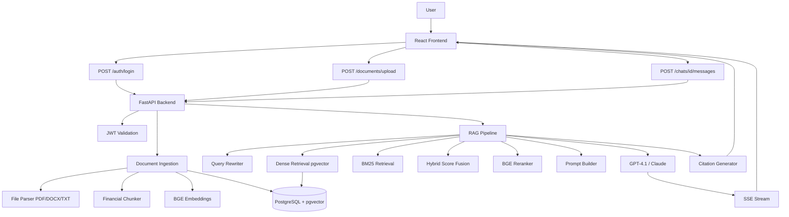

# Financial Research & Decision Support Assistant


## Overview

The **Financial Research Assistant** is an enterprise-grade AI application designed to help analysts extract, synthesize, and verify information from complex financial documents. 

Large Language Models (LLMs) are powerful, but they are prone to hallucinating facts—a critical failure in finance where exact figures matter. This system solves that problem using an advanced **Retrieval-Augmented Generation (RAG)** pipeline. Users upload Annual Reports, Earnings Transcripts, or M&A documents, and the system acts as an expert assistant, answering questions strictly based on the uploaded data and providing verifiable citations for every claim.

### Disclaimer
**This system is intended for financial research and educational purposes only and does not constitute investment advice. Always verify AI-generated figures against the cited original documents.**

---

## Key Features

*   **Hybrid Search Retrieval**: Combines semantic understanding (dense vectors via BGE) with exact keyword matching (sparse TF-IDF/BM25) to find exact financial terminology.
*   **Cross-Encoder Reranking**: Re-evaluates search results to ensure the highest quality context is provided to the LLM.
*   **Verifiable Citations**: The backend strictly controls citations, mapping LLM claims back to the exact document and page number.
*   **Real-time SSE Streaming**: Provides a responsive, chat-like experience by streaming the LLM's output token-by-token.
*   **pgvector Integration**: Keeps relational user data and vector embeddings in a single, robust PostgreSQL database.
*   **Stateless Authentication**: JWT-based secure user sessions.
*   **Financial-Specific Chunking**: Custom text splitting logic designed to respect the structure of financial reports.

---

## Example Financial Questions

Once a company's Annual Report (10-K) is uploaded, you can ask questions like:
1. "What was the total revenue and operating profit for FY24?"
2. "Summarize the key risks mentioned by management regarding supply chain issues."
3. "What were the major capital expenditures this year?"
4. "How did the software services segment perform compared to last year?"
5. "What is the company's total long-term debt position?"
6. "Explain the management's guidance for the upcoming fiscal year."
7. "What factors drove the change in gross margin?"
8. "Did the company declare any dividends, and what was the yield?"
9. "What are the primary drivers of operating expense increases?"
10. "Break down the free cash flow generation."

---

## Architecture

The system uses a modern, decoupled architecture.



For detailed architectural decisions, see [ARCHITECTURE.md](docs/ARCHITECTURE.md).

---

## Tech Stack

| Component | Technology | Rationale |
| :--- | :--- | :--- |
| **Backend Framework** | Python / FastAPI | Native async support, high performance, automatic OpenAPI docs. |
| **Frontend Framework** | React 18 / TypeScript | Robust component model, type safety, Vite for fast builds. |
| **Styling** | Tailwind CSS | Rapid, utility-first UI development. |
| **Database** | PostgreSQL | Enterprise reliability, ACID compliance. |
| **Vector Engine** | pgvector | Stores embeddings alongside relational data, HNSW indexing. |
| **Embedding Model** | BAAI/bge-small-en-v1.5 | High MTEB retrieval performance, local execution, small vector size (384). |
| **LLM Provider** | OpenAI (GPT-4.1) | Industry-leading reasoning and instruction following. (Claude optional). |

---

## RAG Pipeline Deep Dive

When a user asks a question, the backend executes the following pipeline:
1.  **Query Rewriting**: The user's query is analyzed against recent chat history and rewritten into a standalone search phrase.
2.  **Dense Search**: The query is embedded, and `pgvector` finds chunks with similar semantic meaning.
3.  **Sparse Search**: BM25 scans chunks for exact keyword matches (crucial for acronyms like EBITDA).
4.  **Score Fusion**: Dense and sparse scores are normalized and combined (e.g., 70% Dense / 30% Sparse).
5.  **Reranking**: The top candidates are passed through a Cross-Encoder to re-score their true relevance to the query.
6.  **Prompt Construction**: The top 5 chunks are injected into a strict system prompt instructing the LLM to act as a financial analyst.
7.  **Streaming**: The LLM's response is streamed back to the client via Server-Sent Events (SSE).

See [RAG_DOCUMENTATION.md](docs/RAG_DOCUMENTATION.md) for more details.

---

## Project Structure

```text
financial-research-assistant/
├── backend/
│   ├── app/                # FastAPI application code
│   ├── tests/              # Pytest suite
│   ├── requirements.txt
│   └── Dockerfile
├── frontend/
│   ├── src/                # React components and views
│   ├── package.json
│   ├── nginx.conf
│   └── Dockerfile
├── evaluation/             # Scripts to measure RAG retrieval performance
├── docs/                   # Extensive architectural documentation
├── data/
│   └── sample/             # Sample documents for testing
├── .env.example
├── docker-compose.yml
└── README.md
```

---

## Quick Start

### Prerequisites
*   Docker and Docker Compose installed.
*   An OpenAI API key (or Anthropic API key).
*   Git.

### 1. Clone and Setup
```bash
git clone https://github.com/yourusername/financial-research-assistant.git
cd financial-research-assistant
cp .env.example .env
```
*Edit the `.env` file and insert your `OPENAI_API_KEY`.*

### 2. Run with Docker Compose
```bash
docker compose up --build
```
*The first run will download the PostgreSQL image and the BGE embedding weights.*

### 3. Access the Application
*   **Frontend UI**: `http://localhost:3000`
*   **Backend API**: `http://localhost:8000`
*   **API Documentation (Swagger)**: `http://localhost:8000/docs`

---

## Local Development (Without Docker)

### Backend Setup
Requires Python 3.11+ and a running PostgreSQL instance with pgvector.
```bash
cd backend
python -m venv venv
# Activate venv: `venv\Scripts\activate` on Windows or `source venv/bin/activate` on Mac/Linux
pip install -r requirements.txt
uvicorn app.main:app --reload
```

### Frontend Setup
Requires Node.js 20+.
```bash
cd frontend
npm install
npm run dev
```

---

## Environment Variables

| Variable | Description |
| :--- | :--- |
| `DATABASE_URL` | Connection string for PostgreSQL. |
| `SECRET_KEY` | String used to sign JWTs. Keep this secure. |
| `OPENAI_API_KEY` | Your OpenAI API key. |
| `EMBEDDING_MODEL` | HuggingFace model ID for embeddings (default: `BAAI/bge-small-en-v1.5`). |
| `CHUNK_SIZE` | Target token length for document chunks (default: 800). |
| `DENSE_WEIGHT` | Weight given to semantic search in hybrid retrieval (default: 0.7). |

---

## Documentation Index

We maintain comprehensive documentation for developers, contributors, and interview preparation:

*   **[Architecture Details](docs/ARCHITECTURE.md)**: System design and component decisions.
*   **[Database Design](docs/DATABASE_DESIGN.md)**: PostgreSQL schema, vectors, and entity relationships.
*   **[API Documentation](docs/API_DOCUMENTATION.md)**: REST endpoints and SSE streaming format.
*   **[RAG Explanation](docs/RAG_DOCUMENTATION.md)**: How embeddings, hybrid search, and prompt engineering work.
*   **[Financial Domain Guide](docs/FINANCIAL_DOMAIN.md)**: A primer on financial terms for software engineers.
*   **[Evaluation Framework](docs/EVALUATION.md)**: How to measure retrieval Hit Rate and Recall.
*   **[System Limitations](docs/LIMITATIONS.md)**: Honest appraisal of current constraints and LLM risks.
*   **[Future Scope](docs/FUTURE_SCOPE.md)**: Roadmap for OCR, background tasks, and advanced features.
*   **[Interview Preparation](docs/INTERVIEW_PREPARATION.md)**: A guide for explaining this project in technical interviews.

---

## Running Tests

The backend includes a Pytest suite covering authentication, chunking logic, search math, and API integration. (Uses SQLite in-memory).

```bash
cd backend
python -m pytest tests/ -v
```

## Running Evaluation

Measure the actual performance of your retrieval pipeline against sample questions.
```bash
python evaluation/evaluate_retrieval.py --token YOUR_JWT_TOKEN
```
*(Requires the system to be running. Do not fabricate metrics.)*
