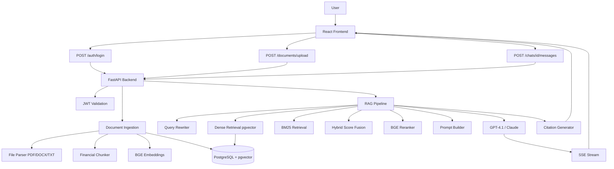

# Architecture of the Financial Research Assistant

This document outlines the architectural decisions and components of the Financial Research Assistant, a Retrieval-Augmented Generation (RAG) based system tailored for processing and querying complex financial documents.

## High-Level System Architecture

## Component Breakdown and Decisions

### 1. React Frontend
The frontend is built using React 18 and TypeScript.
*   **Why React + TypeScript?**: React provides a robust component-based architecture suitable for a chat-like interface. TypeScript adds static typing, which drastically reduces runtime errors and improves developer experience, especially when dealing with complex data structures from the backend API.
*   **Tailwind CSS**: Used for rapid, utility-first styling.

### 2. FastAPI Backend
The core application logic is served via FastAPI (Python).
*   **Why FastAPI?**: Financial document processing involves many I/O bound operations (database queries, LLM API calls). FastAPI's native asynchronous support (`async`/`await`) handles concurrent requests efficiently. Furthermore, its automatic OpenAPI documentation generation is invaluable for frontend integration.

### 3. PostgreSQL Database
PostgreSQL is used as the primary relational database.
*   **Why PostgreSQL?**: Financial applications require strict ACID compliance and high reliability. PostgreSQL is a battle-tested relational database with a massive ecosystem.

### 4. pgvector for Vector Storage
Instead of a dedicated vector database (like Pinecone or Milvus), we use the `pgvector` extension for PostgreSQL.
*   **Why pgvector?**: It allows us to keep our relational data (users, documents, chat history) and vector embeddings in the same database. This significantly reduces architectural complexity, eliminates the need for data synchronization between two different databases, and simplifies backups and maintenance.

### 5. Document Ingestion Flow
When a user uploads a document:
1.  **Parsing**: The file (PDF, TXT) is parsed to extract text.
2.  **Chunking**: Text is split into manageable chunks by the `FinancialChunker`.
3.  **Embedding**: Chunks are converted into dense vectors.
4.  **Storage**: Chunks, metadata, and vectors are saved to PostgreSQL.

### 6. BGE Embeddings
We use the `BAAI/bge-small-en-v1.5` model for generating dense embeddings.
*   **Why BGE?**: It consistently ranks high on the MTEB (Massive Text Embedding Benchmark) for retrieval tasks. The "small" version has a dimensionality of 384, making it highly efficient for storage and fast for similarity searches, while still capturing strong semantic meaning. It can be run locally without external API dependencies.

### 7. BM25 (Sparse Retrieval)
BM25 is a sparse ranking function based on TF-IDF.
*   **Why BM25?**: Dense embeddings often struggle with exact keyword matches (e.g., specific acronyms like "EBITDA", unique company names, or precise financial figures like "₹1,250 crore"). BM25 excels at this, making it a critical component for financial queries where exact terminology matters.

### 8. Hybrid Retrieval
The system combines scores from Dense Retrieval (pgvector) and Sparse Retrieval (BM25).
*   **Why Hybrid?**: By fusing the scores (e.g., using Reciprocal Rank Fusion or weighted linear combination), we get the best of both worlds: semantic understanding from dense embeddings and exact keyword matching from sparse retrieval.

### 9. BGE Reranker
After retrieving the top $N$ candidates via hybrid search, a cross-encoder (BGE Reranker) re-scores them.
*   **Why Reranker?**: Bi-encoders (used for initial retrieval) compare queries and documents independently. Cross-encoders compare them together, understanding the deep interaction between the query and the document text. This greatly improves precision, ensuring the most relevant context is fed to the LLM.

### 10. Query Rewriting
Before retrieval, the user's conversational query is rewritten into a standalone search query.
*   **Why?**: If a user asks "What was the revenue?", followed by "And what about the profit?", the second query lacks context. The query rewriter uses the chat history to reformulate it to "What was the profit for [Company X] in FY24?", improving retrieval accuracy.

### 11. Server-Sent Events (SSE) Streaming
The response from the LLM is streamed back to the frontend using SSE.
*   **Why SSE over WebSockets?**: For a chat application where communication is primarily one-way (server pushing LLM tokens to the client) after the initial request, SSE is simpler to implement, works natively over HTTP/1.1 and HTTP/2, and handles connection drops automatically. WebSockets add unnecessary overhead for this specific pattern.

### 12. Authentication
User authentication is handled via JWT (JSON Web Tokens).
*   **Why Stateless Auth?**: JWT allows the backend to verify users without querying the database for session state on every request, improving scalability.

### 13. Chat Memory Window
The system maintains a sliding window of recent chat messages (e.g., last 10 messages).
*   **Design Decision**: Passing the entire chat history to the LLM consumes context window limits and increases API costs. A sliding window preserves immediate context while keeping token usage efficient.

### Alternatives Considered
*   **Dedicated Vector DB (Chroma, Pinecone)**: Rejected in favor of pgvector to reduce moving parts.
*   **LangChain / LlamaIndex**: We chose custom implementation over heavy frameworks to maintain full control over the retrieval logic, chunking nuances, and prompt construction, which is critical for the strict requirements of financial data.
