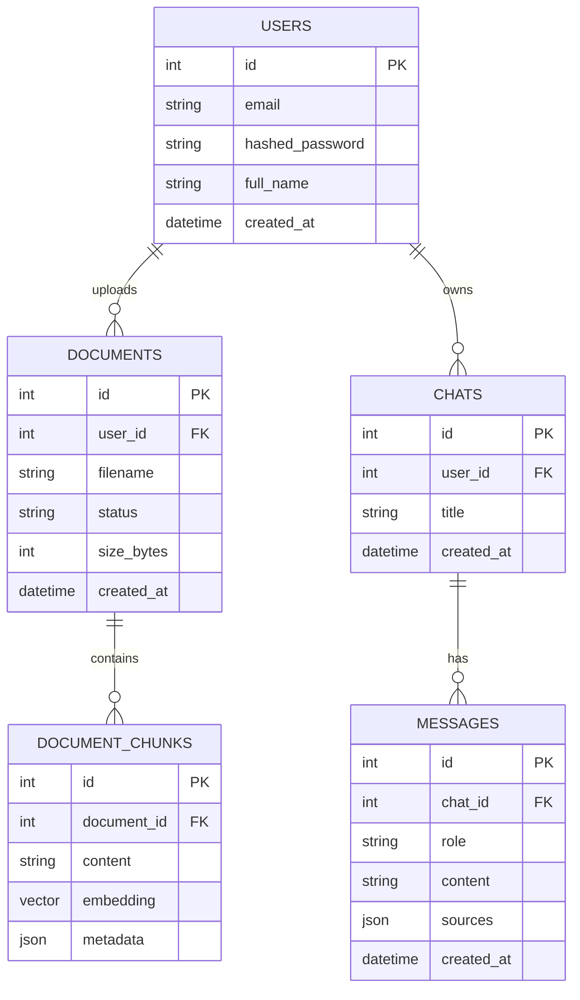

# Database Design

This document details the database schema and the architectural decisions behind it.

## Why PostgreSQL + pgvector?

We chose PostgreSQL with the `pgvector` extension over a dedicated vector database (like Pinecone, Milvus, or ChromaDB).

*   **Single Source of Truth**: User data, document metadata, chat history, and vector embeddings all live in one database. This eliminates the "split-brain" problem where a relational DB and a vector DB get out of sync.
*   **ACID Compliance**: Crucial for enterprise applications. If a document deletion fails halfway, the transaction rolls back cleanly.
*   **Simplified Infrastructure**: Fewer moving parts to deploy, monitor, and back up.
*   **Performance**: `pgvector` supports advanced indexing (HNSW) and performs exceptionally well for millions of vectors, which is sufficient for our scale.

## Entity Relationship Diagram

## Table Definitions

### 1. `users` Table
*   **Purpose**: Manages authentication and data ownership.
*   **Key Fields**: `email` (unique index), `hashed_password` (bcrypt).
*   **Security Note**: Passwords are never stored in plain text.

### 2. `documents` Table
*   **Purpose**: Tracks files uploaded by users.
*   **Key Fields**: 
    *   `status`: An enum representing the ingestion lifecycle (`processing`, `ready`, `failed`). This is necessary because embedding large PDFs is an asynchronous process.
    *   `filename`: Original name of the file.

### 3. `document_chunks` Table
*   **Purpose**: Stores the actual text and its vector representation for RAG.
*   **Key Fields**:
    *   `content`: The chunked text from the document.
    *   `embedding`: `Vector(384)` type provided by `pgvector`. 384 matches the output dimension of the BGE-small model.
    *   `metadata`: A JSONB column. 
*   **Design Rationale**: We denormalize some data into the `metadata` column (e.g., `page_number`, `document_name`). When retrieving a chunk via vector search, we need this metadata immediately to construct citations without doing complex joins back to the `documents` table.

### 4. `chats` Table
*   **Purpose**: Groups messages into conversational sessions.
*   **Scope**: Chats can optionally be linked to specific documents, allowing users to "chat with a specific PDF" rather than the entire corpus.

### 5. `messages` Table
*   **Purpose**: Stores the history of the conversation.
*   **Key Fields**:
    *   `role`: 'user', 'assistant', or 'system'.
    *   `sources`: A JSONB column storing the citations (document IDs, page numbers) used by the assistant to generate this specific message.

## Indexing Strategy

1.  **Relational Indexes**: Foreign keys (`user_id`, `document_id`, `chat_id`) are indexed to speed up standard lookups.
2.  **Vector Index (HNSW)**: 
    *   We use the **Hierarchical Navigable Small World (HNSW)** index for the `embedding` column.
    *   **HNSW vs IVFFlat**: IVFFlat requires building the index *after* data is inserted and has lower recall. HNSW builds the graph incrementally, supports fast insertions, and offers superior recall and latency tradeoffs.
    *   **SQL for creation**: `CREATE INDEX ON document_chunks USING hnsw (embedding vector_cosine_ops);` (We use cosine similarity for embedding comparison).

## Alternatives Considered
*   **ChromaDB**: Easier to setup initially for prototypes, but lacks relational integrity with user accounts.
*   **FAISS**: Extremely fast, but runs in-memory and requires complex engineering to persist to disk and handle updates/deletions. PostgreSQL provides persistence natively.
